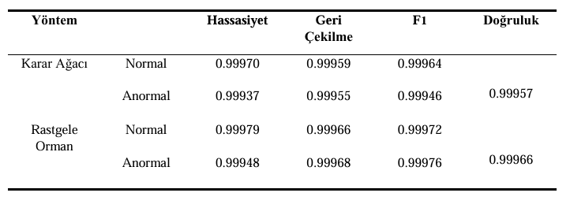
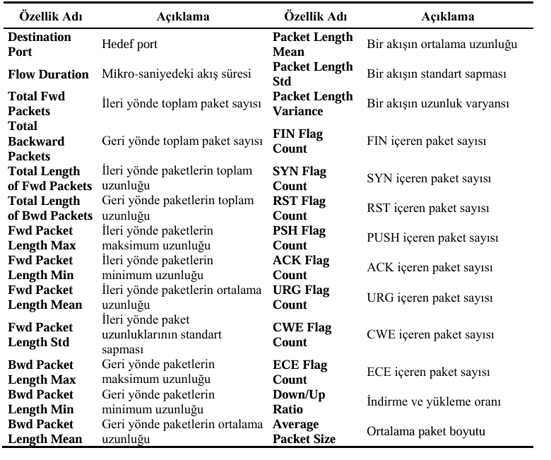
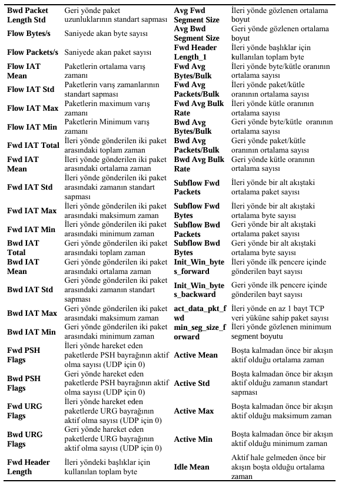
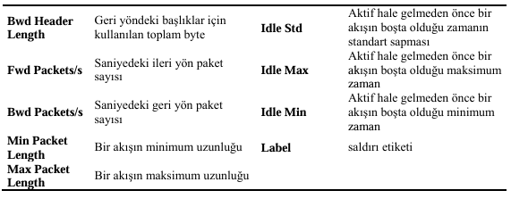

#  **INTRUSION DETECTION WITH MACHINE LEARNING**

##  **Anormal Ağ Trafiğinin Tespiti - CICIDS2017**

Bu proje, Kanada Siber Güvenlik Enstitüsü (CIC) tarafından yayımlanan CICIDS2017 veri kümesi kullanılarak ağ trafiğinde anomali (saldırı) tespiti için bir makine öğrenmesi modeli geliştirmeyi amaçlar.

---

##  **KAYNAK**

"Makine Öğrenmesi Yöntemleriyle Anormal Ağ Trafiğinin Tespiti" adlı akademik çalışma temel alınmıştır.

**Çalışma:** https://dergipark.org.tr/tr/pub/dubited/issue/43004/498358

**Çalışmada elde edilen sonuçlar:**

**Veri Seti:** https://www.kaggle.com/datasets/chethuhn/network-intrusion-dataset/data

---

## **AMAÇ**

Ağ trafiği kayıtlarından çıkarılan istatistiksel özellikler kullanılarak, normal ve anormal trafiğin (DoS, DDoS, Botnet vb.) sınıflandırılması hedeflenmektedir.

---

## 🗂 **VERİ KÜMESİ**

**CICIDS2017:** Gerçek dünya senaryolarında oluşturulmuş ağ trafiği.
- 78+ özellik içeren .csv dosyaları kullanılmıştır
- Özellikler CICFlowMeter ile ağ trafiğinden çıkarılmıştır
- CICFlowMeter ile ağ trafiğinden özelliklerin nasıl çıkartıldığı ve bu özellikler hakkında detaylı bilgiler **Npcap Network Repo**sunda paylaşılacaktır

---

##  **KAYNAK KOD**

### 1️⃣ ** Veri Yükleme ve Birleştirme**
Tüm .csv dosyaları okunur ve tek bir DataFrame'de birleştirilir.

### 2️⃣ ** Veri Temizleme**
- Eksik değerler ve inf değerler kontrol edilip temizlenir
- Yinelenen satırlar kaldırılır
- Boşluk içeren sütun isimleri düzeltildi

### 3️⃣ ** Veri Analizi**
- Saldırı türlerinin dağılımı görselleştirildi
- Flow Bytes/s gibi bazı değişkenlerin istatistikleri farklı saldırı türleri için incelendi

### 4️⃣ ** Özellik Seçimi**
- Varyansı 0 olan özellikler çıkarıldı
- Aynı olan sütunlar (ör. Total Fwd Packets = Subflow Fwd Packets) silindi
- Korelasyonu yüksek (> 0.9) olan sütunlar tespit edildi

### 5️⃣ **⚗ PCA (Principal Component Analysis)**
Korelasyonu yüksek bazı sütunlar PCA ile birleştirildi (ör: Bwd Packet Length Max, Mean, Std).

### 6️⃣ ** Model Eğitimi**
- Random Forest ve Decision Tree modelleri eğitildi
- Verinin %70'i eğitim, %30'u test için kullanıldı
- Performans classification_report ile ölçüldü

### 7️⃣ ** Özellik Önem Değerlendirmesi**
En etkili 20 özellik görselleştirildi.

### 8️⃣ ** Model Kaydetme**
Eğitim tamamlanan Random Forest ve Decision Tree Classifier modeli `rf_model.pkl` ve `dt_model.pkl` olarak kaydedildi.

---

##  **KULLANILAN KÜTÜPHANELERs**

- **pandas, numpy** - Veri manipülasyonu
- **matplotlib, seaborn** - Görselleştirme
- **sklearn** - Makine öğrenmesi (RandomForestClassifier, DecisionTreeClassifier, PCA, train_test_split)
- **joblib** - Model kaydetme/yükleme

---

##  **NOTLAR**

⚠ **Ölçekleme (StandardScaler)** bazı modeller için önerilir (SVM, KNN), ancak bu proje temel modellerle başlamıştır.

 **Geliştirme** için CUDA destekli modeller (XGBoost GPU) ileride entegre edilebilir.

---

###  **İletişim**
Proje hakkında sorularınız için issue açabilir veya katkıda bulunabilirsiniz!

---
