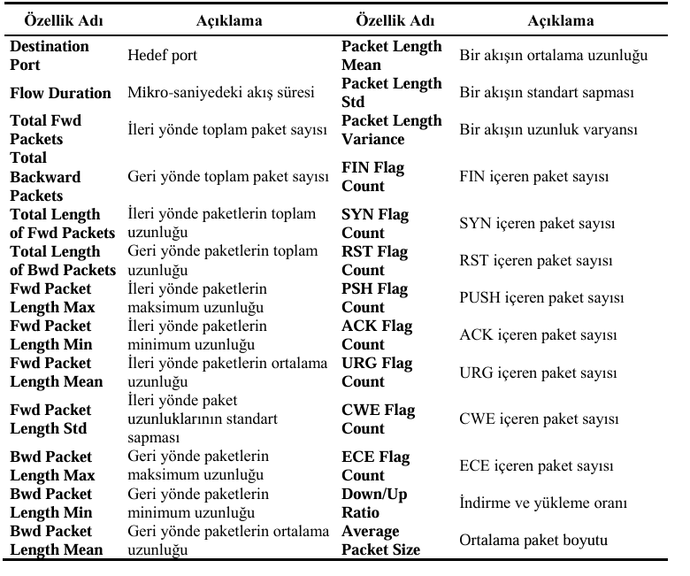
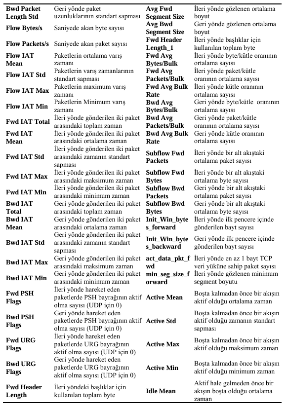
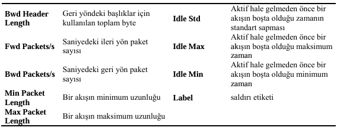
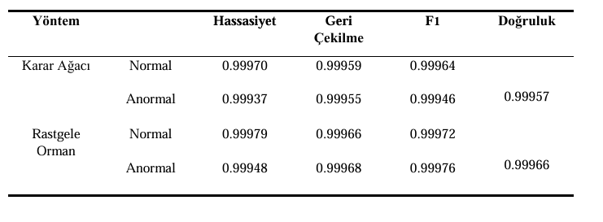

# 🛡️ Intrusion Detection with Machine Learning  
### Anormal Ağ Trafiğinin Tespiti – CICIDS2017

Bu proje, **Kanada Siber Güvenlik Enstitüsü (CIC)** tarafından yayımlanan **CICIDS2017** veri kümesi kullanılarak anormal ağ trafiğinin tespiti için makine öğrenmesi modelleri geliştirmeyi amaçlamaktadır. 
Projede toplam 2 milyon 830 bin 743 adet ağ trafiği örneği (row) kullanılmış. Her biri 79 özellik (column) içermekte.

---

## 📑 İçindekiler
- [📌 Giriş](#📌-giriş)
- [📂 Veri Kümesi](#📂-veri-kümesi)
- [⚙️ Yöntemoloji](#⚙️-yöntemoloji)
- [🧹 Veri Ön İşleme](#🧹-veri-ön-i̇şleme)
- [🧠 Model Geliştirme](#🧠-model-geliştirme)
- [📈 Model Değerlendirme](#📈-model-değerlendirme)
- [✅ Sonuç ve Tartışma](#✅-sonuç-ve-tartışma)
- [⚠️ Zorluklar ve Sınırlılıklar](#⚠️-zorluklar-ve-sınırlılıklar)
- [📚 Kaynaklar](#📚-kaynaklar)

---

## 📌 Giriş

Günümüzde artan siber tehditler karşısında, ağ trafiğini analiz eden **Anomali Tabanlı Saldırı Tespit Sistemleri (IDS)** büyük önem taşımaktadır. Bu proje, **CICIDS2017** verisinden çıkarılan özelliklerle normal ve saldırgan trafiği ayırt edebilen bir **Makine Öğrenmesi Tabanlı IDS** sistemi geliştirmeyi hedefler.

> Kaynak alınan akademik çalışma:  
> ["Makine Öğrenmesi Yöntemleriyle Anormal Ağ Trafiğinin Tespiti"](https://dergipark.org.tr/tr/pub/dubited/issue/43004/498358)

---

## 📂 Veri Kümesi

📁 **CICIDS2017**  
- Gerçek kullanıcı davranışlarını içeren, güncel saldırı türlerini barındıran ağ trafiği verisi.  
- Özellik çıkarımı **CICFlowMeter** aracıyla yapılmıştır.  
- Toplam **78+ özellik** ve çoklu saldırı türü içerir.
- CICFlowMeter ile ağ trafiğinden özelliklerin nasıl çıkartıldığı ve bu özellikler hakkında detaylı bilgiler Npcap---Network Reposunda paylaşılacaktır.

📥 Veri seti: [Kaggle Üzerinden İndir](https://www.kaggle.com/datasets/chethuhn/network-intrusion-dataset/data)

### 🔬 Özellik Görselleri

  
  


---

## ⚙️ Yöntemoloji

Proje süreci aşağıdaki adımlardan oluşmaktadır:

1. Verilerin yüklenmesi ve birleştirilmesi  
2. Temizlik ve ön işleme işlemleri  
3. Saldırı türlerinin dağılımının analizi  
4. Özellik seçimi ve boyut indirgeme (PCA)  
5. Makine öğrenmesi modellerinin eğitilmesi  
6. Performans ölçümü ve değerlendirme  
7. Modellerin kaydedilmesi

---

## 🧹 Veri Ön İşleme

- Eksik (`NaN`) ve sonsuz (`inf`) değerler temizlendi.  
- Yinelenen satırlar kaldırıldı.  
- **Varyansı 0** olan sütunlar çıkarıldı.  
- **Eş anlamlı** (aynı veri içeren) sütunlar silindi.  
  - Örn: `Total Fwd Packets` = `Subflow Fwd Packets`  
- **Yüksek korelasyonlu** (ρ > 0.9) değişkenler tespit edildi.  
- **PCA (Principal Component Analysis)** ile bazı değişkenler birleştirildi.

---

## 🧠 Model Geliştirme

Proje kapsamında iki makine öğrenmesi modeli eğitildi:

- 🌲 **Random Forest Classifier**  
- 🌳 **Decision Tree Classifier**

Veri oranı:
- %70 Eğitim
- %30 Test

### 🧪 Kullanılan Python Kütüphaneleri

```python
pandas, numpy, matplotlib, seaborn  
sklearn (RandomForestClassifier, DecisionTreeClassifier, PCA, train_test_split)  
joblib
```

---

## 📈 Model Değerlendirme

Model performansı `classification_report` ile değerlendirildi. Kaynak kodun içerisinde paylaşılmıştır.

- **Random Forest**, daha yüksek doğruluk ve genelleme başarısı gösterdi.  
- **Confusion Matrix** analizi ile yanlış sınıflandırmalar incelendi.  
- Özellik önem dereceleri çıkarılarak, modeli etkileyen en güçlü değişkenler belirlendi:

📊 **En önemli 20 özellik:**



---

## ✅ Sonuç 

- Hem akademik çalışmalarda hem bu çalışmada modeller çok iyi performans göstermiştir.
- PCA, özellik boyutunu azaltarak eğitim süresini kısalttı . Fakat PCA sonrası eğitilen modeller kodda paylaşılmadı.  
- En etkili özellikler genellikle paket boyutları, yön bilgileri ve akış süreleri oldu.  
- CICIDS2017 veri kümesi sayesinde gerçekçi bir senaryo oluşturulabildi.

---

## ⚠️ Zorluklar ve Sınırlılıklar

- **Sınıf dengesizliği**, az sayıda saldırı türünün öğrenilmesini zorlaştırabilir.  
- **Model yorumlanabilirliği** derin öğrenme kullanılmadığı için şu an anlaşılır, ancak ileri aşamada karmaşık hale gelebilir.  
- Yeni saldırı türlerine karşı **genelleme yeteneği**, modelin güncellenmesini gerektirir.

---

## 📚 Kaynaklar

- CICIDS2017 Dataset – [Kaggle](https://www.kaggle.com/datasets/chethuhn/network-intrusion-dataset/data)  
- ["Makine Öğrenmesi Yöntemleriyle Anormal Ağ Trafiğinin Tespiti"](https://dergipark.org.tr/tr/pub/dubited/issue/43004/498358)  
- scikit-learn Documentation  
- CICFlowMeter – Feature Extraction Aracı
